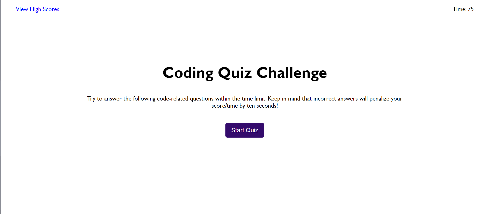
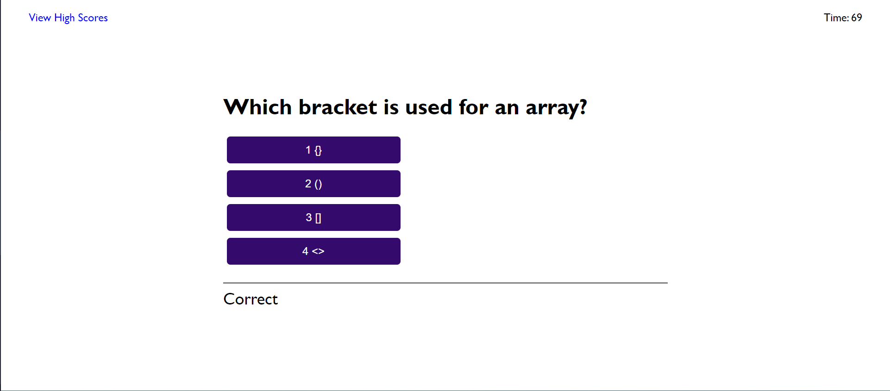
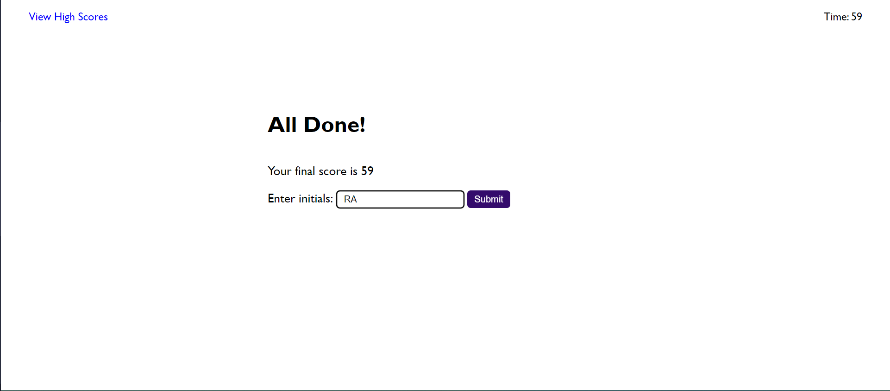
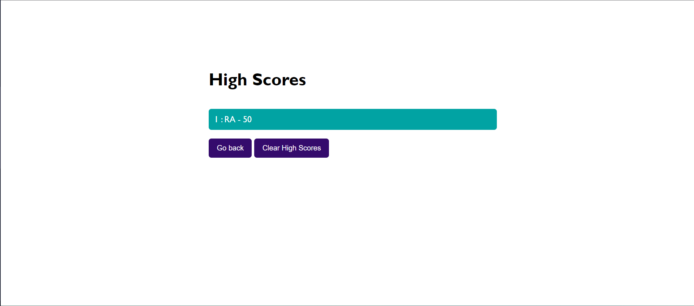

# CodingQuiz

This is a timed quiz application that focuses on testing your knowledge of Web Development fundamentals. You can use this quiz to assess your understanding of key concepts and compare your scores with your peers.

## Table of Contents
- [Features](#features)
- [Usage](#usage)
- [Screenshots](#screenshots)
- [Contributing](#contributing)
- [License](#license)

### Prerequisites
- Make sure you have a modern web browser installed (e.g., Google Chrome, Mozilla Firefox).

### Installation
1. Clone the repository to your local machine:
   ```bash
   git clone https://github.com/XenodiusAlpha/codingQuiz.git
   ```

2. Open the `index.html` file in your preferred web browser.

## Features

- Start a timed quiz by clicking the "Start" button.
- Answer a series of web developer related questions.
- Incorrect answers result in a 10 second time penalty.
- The game ends when all questions are answered or the timer reaches 0.
- Save your initials and score at the end of the game.
- High scores are stored for future reference.

## Usage

1. Open the `index.html` file in your web browser.
2. Click the "Start Quiz" button to begin the quiz.
3. Answer each question by selecting the correct option.
4. If you answer incorrectly, time will be deducted from the clock.
5. The game ends when all questions are answered or when the timer reaches 0.
6. Enter your initials and save your score when prompted.

## Screenshots


*Quiz Start Screen*


*Example Question*


*Game Over Screen*


*High Scores Screen*

## Contributing

Contributions are welcome! If you find any bugs or have suggestions for improvement, please open an issue or submit a pull request.

## License

This project is licensed under the MIT License - see the [LICENSE](LICENSE) file for details.

## Deployment Link

